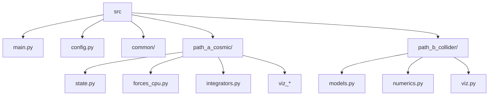

# Architecture Overview

Source layout (flat `src/`):

- `src/main.py` – tiny CLI entry stub.
- `src/config.py` – shared configuration dataclasses.
- `src/common/` – logging and other simple utilities.
- `src/path_a_cosmic/` – early-universe gravity demo (Path A).
- `src/path_b_collider/` – collider models (Path B).

